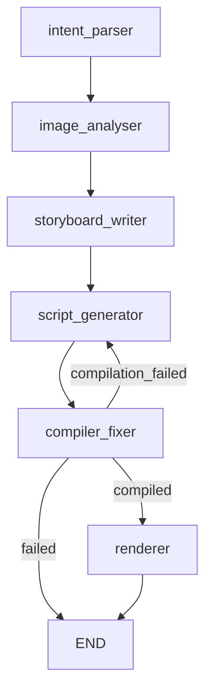

# FotoOwl Image-to-Video Multiagent Pipeline

This repository contains the complete implementation of the **FotoOwl Image-to-Video Multiagent Pipeline**, built as a take-home technical task for the AI Engineer position. The pipeline parses user stylistic prompts, selects a matching subset of event photos, generates a structured storyboard, compiles a dynamic React-based Remotion composition, and renders the final styled MP4 video reel automatically.

---

## 1. System Architecture

The orchestration is built using **LangGraph** to model the pipeline as a stateful graph. The state flows through five specialized agents with self-correcting feedback loops.



### Graph Nodes & Execution Flow
1. **Intent Parser**: Parses the user's prompt into a structured JSON configuration (`VideoIntent`) mapping pacing, colors, mood, captions, transitions, and audio tempo.
2. **Image Analyser**: Processes images and extracts descriptions, lighting details, and dominant colors.
3. **Storyboard Writer**: Queries the local RAG vector store for the style guide matching the intent, then selects a subset of 5–12 images and sequences them into a chronological narrative arc with custom captioning, transition durations, and Ken Burns animations.
4. **Script Generator**: Generates a dynamic React `Composition.tsx` file for Remotion. The composition imports `storyboard.json` and maps it programmatically to calculate start frames and layer slides at runtime.
5. **Compiler & Fixer**: Runs a TypeScript type-checker inside the Remotion project. If type errors occur, it routes feedback to the Script Generator to fix them in a repair loop (up to 3 retries).
6. **Renderer**: Executes `npx remotion render` on success to output the finished MP4 video file.

---

## 2. Model Selection Rationale

Following the June 2026 Groq deprecations, we transitioned to a hybrid, dynamic provider routing strategy to optimize token consumption and request rates.

| Node | Model ID | Provider | Rationale |
| :--- | :--- | :--- | :--- |
| **Intent Parser** | `openai/gpt-oss-20b` | Groq | Ultra-fast, highly cost-effective model for generating structured JSON schemas. |
| **Image Analyser** | `meta/llama-4-maverick-17b-128e-instruct` | NVIDIA NIM | **Multimodal Vision**. Processes batches of 5 images in parallel, bypassing Groq's 8,000 TPM limit. Fallback to `qwen/qwen3.6-27b` (batch size 1) is active. |
| **Storyboard Writer** | `qwen/qwen3.6-27b` | Groq | Large reasoning context to synthesize style guide rules and image lists into a storyboard. |
| **Script Generator** | `openai/gpt-oss-120b` | Groq | Premier code-generation capability to write valid React/TypeScript code. |
| **Compiler & Fixer** | `openai/gpt-oss-120b` | Groq | High reasoning capacity to analyze typecheck errors and compile fixes. |

---

## 3. RAG Design Decisions

* **Local Vector Store**: Built using `ChromaDB` running completely offline, requiring zero cloud credentials.
* **Seeding & Collections**: Seeded with official Remotion API code snippets, TypeScript interfaces, and styling guides (e.g. *Cinematic*, *Upbeat/Energetic*, *Corporate* style guides).
* **Retrieval Approach**: Implements a custom, deterministic keyword embedding function that ensures search queries retrieve highly relevant syntax definitions (like `Sequence`, `interpolate`, transition animations) for the script generator.

---

## 4. Engineering Highlights & Optimizations

* **Pillow Image Compression**: Images are compressed and resized to `1024px` locally before base64 encoding. This keeps combined batch payloads below 1MB (well under Nvidia's 25MB limit), speeding up upload times.
* **Premium Slide Layout**: Renders double-layered image sequences in Remotion: a blurred background stretched to cover the frame, and a contain-fit foreground image with slow scale animation. This ensures **subject faces are never cropped** regardless of the input photo aspect ratio.
* **Timeline Overlap Math**: Programmatically calculates overall timeline duration by subtracting overlaps between crossfading slides, preventing trailing black screens at the end of the video.
* **Unicode/ANSI Safe Loggers**: Subprocess runners and console prints use ASCII-safe conversions, preventing terminal encoding crashes on Windows consoles during Remotion progress rendering.

---

## 5. Setup & Running Locally

### Dependencies
* **Python**: 3.11 or later
* **Node.js**: v18 or later (npm v10+)

### Step 1: Install Dependencies
1. Install Python packages:
   ```bash
   pip install -r requirements.txt
   ```
2. Install Remotion npm packages:
   ```bash
   cd video-project
   npm install
   cd ..
   ```

### Step 2: Configure Environment
Create a `.env` file in the project root containing your API keys (see `.env.example`):
```env
GROQ_API_KEY=gsk_your_key_here
NVIDIA_API_KEY=nvapi-your_key_here
```

### Step 3: Crawl & Reorganize Google Drive Images
Run the downloader script to pull all 73 event images and categorize them into prefix subdirectories (e.g. `input_images/ASL/`, `input_images/AHD/`):
```bash
python download_and_separate.py
```

### Step 4: Run the Pipeline
Run the main script, passing your creative prompt and target images folder:
```bash
# Example 1: Cinematic Wedding Reel on ASL images
python main.py --prompt "Cinematic wedding reel, slow and emotional, warm tones, minimal text" --images-dir input_images/ASL

# Example 2: Upbeat Birthday Reel on PLAY images
python main.py --prompt "Upbeat birthday reel, fast cuts, bold captions, energetic" --images-dir input_images/PLAY
```
The rendered video will be saved directly to `output/video.mp4`.

### Running Tests
Unit tests and evaluation judges run offline without requiring active API keys:
```bash
python -m pytest
```

---

## 6. Known Limitations & Future Roadmap
1. **Audio Integration**: Currently, the pipeline focuses on visual pacing and typography. In the future, we would add dynamic background audio selection and beat-matching cuts using Remotion's audio element.
2. **Text-to-Speech (TTS) voiceover**: A Script Generator agent could generate an audio voiceover script, query an ElevenLabs/TTS API, and layer the voiceover track under the slides.
3. **Advanced Transitions**: Implement custom WebGL transitions (like page curls or custom zooms) to enhance visual storytelling.
